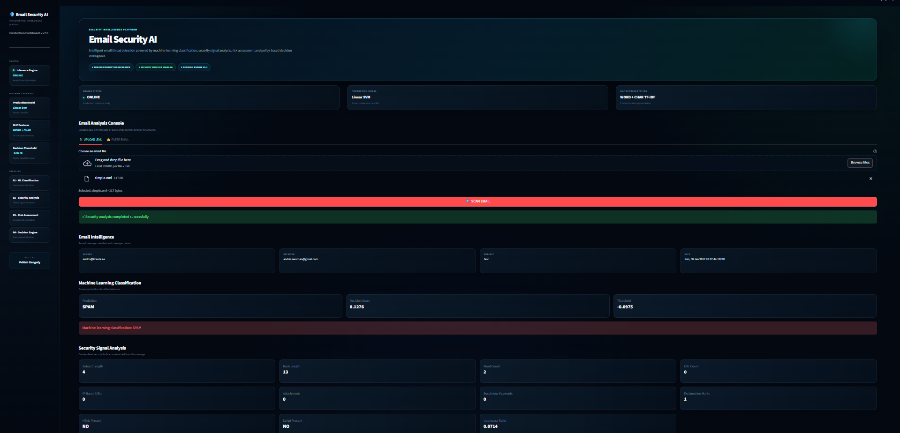
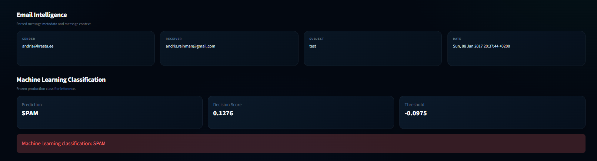
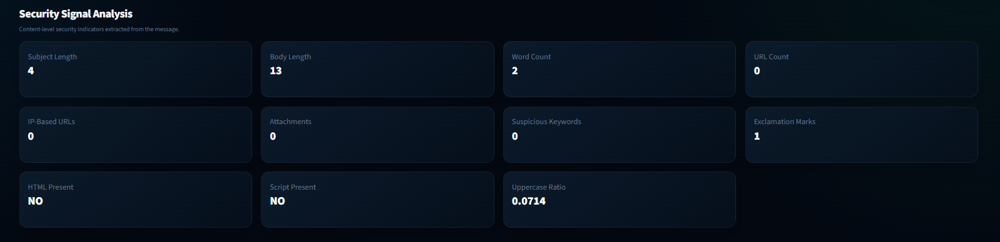
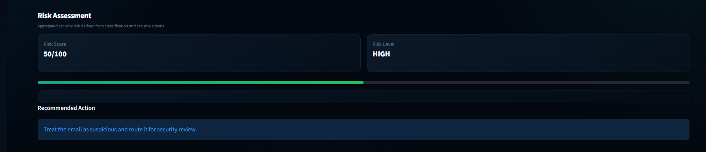
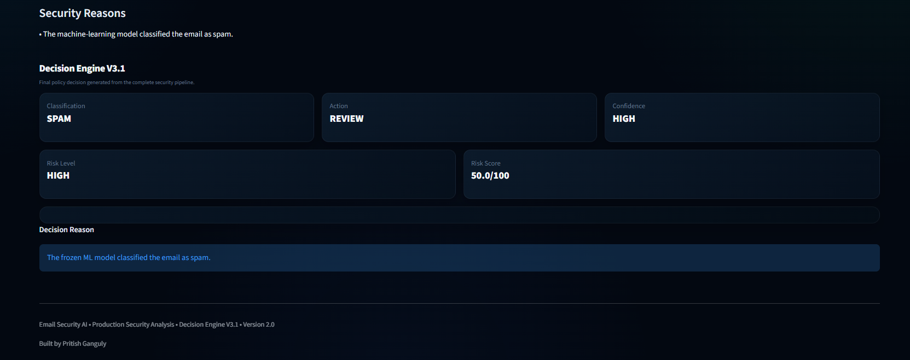

# Email Security AI

A production-oriented email threat analysis platform that combines machine-learning spam classification, email security signal analysis, risk assessment, and policy-based decision intelligence into a single security workflow.

**Built by Pritish Ganguly**

---

## Overview

**Email Security AI** is an end-to-end email security analysis application designed to inspect raw email messages and produce an explainable security assessment.

The application accepts either:

* Raw `.eml` files
* Pasted email content

The email is processed through a multi-stage security pipeline:

```text
Raw Email
    │
    ▼
Email Parsing
    │
    ▼
Word TF-IDF + Character TF-IDF
    │
    ▼
Frozen Linear SVM
    │
    ▼
Machine-Learning Classification
    │
    ▼
Security Signal Analysis
    │
    ▼
Risk Assessment
    │
    ▼
Decision Engine V3.1
    │
    ▼
Final Security Decision
```

The production application does not retrain the model during inference. It loads the frozen production model and applies the configured production decision threshold.

---

## Key Features

### Email Analysis

* `.eml` file upload
* Direct email-content analysis
* Email metadata extraction
* Sender and receiver identification
* Subject extraction
* Date extraction
* Attachment detection
* Temporary processing of uploaded messages

### Machine-Learning Classification

* Word-level TF-IDF representation
* Character-level TF-IDF representation
* Linear SVM production classifier
* Frozen production inference
* Spam / non-spam classification
* Production decision threshold

The project evaluated multiple classification approaches, including Naive Bayes, Logistic Regression, and Linear SVM. Linear SVM is used as the production classifier.

### Security Signal Analysis

The security analysis layer extracts content-level indicators from the email, including:

* Subject length
* Body length
* Word count
* URL count
* IP-based URL count
* Suspicious keyword count
* HTML presence
* Script presence
* Attachment count
* Exclamation marks
* Uppercase ratio

### Risk Assessment

The Risk Engine aggregates the machine-learning classification and security indicators into a security risk assessment.

The application presents:

* Risk score
* Risk level
* Security reasons
* Recommended action

The risk score is represented on a `0–100` scale.

### Decision Engine V3.1

The final stage converts the complete analysis into a policy-based security decision.

The dashboard presents:

* Classification
* Action
* Confidence
* Risk level
* Risk score
* Decision reason

The Decision Engine is executed after machine-learning prediction, security analysis, and risk assessment.

---

# Dashboard

The application provides a modern dark security-operations-style dashboard.

The interface includes:

* Security Intelligence Platform header
* Production inference status
* Production model information
* NLP representation information
* Email Analysis Console
* `.eml` upload workflow
* Paste-email workflow
* Machine-learning results
* Security signal analysis
* Risk assessment
* Decision Engine V3.1 results
* Final security decision
* Production attribution

The dashboard is implemented using Streamlit with a custom dark security-oriented interface.

---

## Production Configuration

| Component          | Production Configuration       |
| ------------------ | ------------------------------ |
| Application        | Email Security AI              |
| Production Model   | Linear SVM                     |
| NLP Representation | Word TF-IDF + Character TF-IDF |
| Decision Threshold | `-0.0975`                      |
| Security Layer     | Security Analyzer              |
| Risk Layer         | Risk Engine                    |
| Decision Layer     | Decision Engine V3.1           |
| Interface          | Streamlit                      |
| Input              | `.eml` / pasted email          |
| Risk Scale         | `0–100`                        |

The current application configuration identifies Linear SVM as the production model and uses a decision threshold of `-0.0975`.

---

# System Architecture

The project separates the email-security workflow into dedicated processing layers.

```text
                         ┌─────────────────────┐
                         │      Raw Email      │
                         │   .eml / Paste      │
                         └──────────┬──────────┘
                                    │
                                    ▼
                         ┌─────────────────────┐
                         │    Email Parser     │
                         │ Metadata + Content  │
                         └──────────┬──────────┘
                                    │
                                    ▼
                    ┌──────────────────────────────┐
                    │       NLP Representation     │
                    │                              │
                    │       Word TF-IDF            │
                    │             +                │
                    │      Character TF-IDF        │
                    └──────────────┬───────────────┘
                                   │
                                   ▼
                         ┌─────────────────────┐
                         │    Linear SVM       │
                         │ Frozen Classifier   │
                         └──────────┬──────────┘
                                    │
                                    ▼
                         ┌─────────────────────┐
                         │ Security Analyzer   │
                         │ Content Indicators  │
                         └──────────┬──────────┘
                                    │
                                    ▼
                         ┌─────────────────────┐
                         │     Risk Engine     │
                         │   0–100 Risk Score  │
                         └──────────┬──────────┘
                                    │
                                    ▼
                         ┌─────────────────────┐
                         │ Decision Engine     │
                         │       V3.1          │
                         └──────────┬──────────┘
                                    │
                                    ▼
                         ┌─────────────────────┐
                         │ Final Security      │
                         │ Decision            │
                         └─────────────────────┘
```

The repository already contains the architecture diagram:

`docs/images/architecture.png`

---

# Project Structure

```text
email-security-ai/
│
├── app.py
│
├── api/
│
├── config/
│
├── dashboard/
│
├── data/
│   ├── raw/
│   ├── interim/
│   └── processed/
│
├── docs/
│   └── images/
│       └── architecture.png
│
├── models/
│
├── src/
│   ├── data/
│   ├── detection/
│   ├── features/
│   ├── models/
│   ├── preprocessing/
│   ├── scanner/
│   ├── security/
│   └── utils/
│
├── tests/
│
├── README.md
│
└── requirements.txt
```

The main Streamlit application loads the production scanner and predictor and executes the complete analysis pipeline through the security and decision layers.

---

# Machine-Learning Pipeline

The project uses a text-classification pipeline based on two complementary TF-IDF representations.

```text
                 Email Text
                     │
          ┌──────────┴──────────┐
          ▼                     ▼
     Word TF-IDF          Character TF-IDF
          │                     │
          └──────────┬──────────┘
                     ▼
              Feature Space
                     │
                     ▼
              Frozen Linear SVM
                     │
                     ▼
             Spam Classification
```

### Word TF-IDF

Word-level TF-IDF captures patterns based on tokens and word combinations.

### Character TF-IDF

Character-level TF-IDF captures character-level patterns and provides a complementary representation to word-level features.

### Linear SVM

The trained Linear SVM is used as the frozen production classifier.

The application performs inference using the existing production artifacts rather than retraining the model during normal dashboard operation.

---

# Security Analysis Pipeline

Machine-learning classification is only one component of the system.

The application also examines security-related characteristics of the message.

```text
Email Content
     │
     ├── Subject Analysis
     ├── Body Analysis
     ├── URL Analysis
     ├── IP URL Detection
     ├── Keyword Analysis
     ├── HTML Detection
     ├── Script Detection
     ├── Attachment Analysis
     ├── Word Count
     ├── Uppercase Ratio
     └── Exclamation Analysis
              │
              ▼
       Security Indicators
```

These indicators are passed to the risk-assessment stage.

---

# Risk Assessment

The Risk Engine combines the available machine-learning and security-analysis information into a unified risk assessment.

```text
ML Classification
       +
Security Indicators
       │
       ▼
  Risk Engine
       │
       ├── Risk Score
       ├── Risk Level
       ├── Security Reasons
       └── Recommended Action
```

The dashboard exposes the resulting assessment directly to the analyst.

---

# Decision Engine V3.1

The Decision Engine provides the final policy-level interpretation of the security pipeline.

```text
Classification
       +
Security Analysis
       +
Risk Assessment
       │
       ▼
Decision Engine V3.1
       │
       ├── Classification
       ├── Action
       ├── Confidence
       ├── Risk Level
       ├── Risk Score
       └── Decision Reason
```

This allows the application to present a single final security decision while retaining the intermediate evidence used to reach it.

---

# Example Analysis

A typical analysis produces information similar to:

```text
Prediction
SPAM

Decision Score
0.1276

Threshold
-0.0975

Risk Score
50/100

Risk Level
HIGH

Action
REVIEW

Confidence
HIGH
```

The exact values depend on the email being analyzed.

---

# Installation

## 1. Clone the repository

```bash
git clone https://github.com/pritish-ganguly/email-security-ai.git
cd email-security-ai
```

## 2. Create a virtual environment

### Windows

```powershell
python -m venv .venv
```

Activate it:

```powershell
.venv\Scripts\Activate.ps1
```

If PowerShell execution policy prevents activation, the environment can also be activated through the PyCharm terminal or by using the Python executable directly.

### Linux / macOS

```bash
python3 -m venv .venv
source .venv/bin/activate
```

## 3. Install dependencies

```bash
pip install -r requirements.txt
```

---

# Running the Application

From the project root:

```bash
python -m streamlit run app.py
```

The Streamlit application will start locally.

The dashboard provides two primary analysis workflows:

### Upload an `.eml`

Upload a raw email file through the **Upload .eml** interface.

### Paste an email

Paste email content directly into the analysis interface.

---

# Testing

The project contains automated tests covering the application components.

Run:

```bash
pytest -q
```

Current project verification:

```text
10 passed in 4.54s
```

The application and scanner were also syntax-checked successfully using Python compilation checks.

---

# Security and Production Design Principles

The project follows several design principles:

### Frozen inference

The production model is loaded for inference rather than retrained by the dashboard.

### Layered analysis

Machine-learning classification is combined with independent security indicators.

### Explainability

The application exposes security reasons, risk information, and decision reasoning rather than presenting only a binary prediction.

### Separation of responsibilities

The system separates:

* Email parsing
* Machine-learning prediction
* Security analysis
* Risk assessment
* Final decision generation

### Reproducible inference

The configured production classifier and threshold are kept explicit in the application configuration.

---

# Technology Stack

| Technology   | Purpose                               |
| ------------ | ------------------------------------- |
| Python       | Core application and ML pipeline      |
| Streamlit    | Security analysis dashboard           |
| scikit-learn | Machine-learning pipeline             |
| TF-IDF       | Text feature representation           |
| Linear SVM   | Production classifier                 |
| pandas       | Data processing                       |
| NumPy        | Numerical processing                  |
| NLTK         | Natural-language processing utilities |
| joblib       | Model/artifact persistence            |
| pytest       | Automated testing                     |

---

# Development Workflow

The project can be developed and tested locally using:

```text
PyCharm
   │
   ▼
Virtual Environment
   │
   ▼
Python Application
   │
   ├── ML Model
   ├── Email Scanner
   ├── Security Analyzer
   ├── Risk Engine
   └── Decision Engine
          │
          ▼
     Streamlit Dashboard
```

---

# Project Status

Current implementation includes:

* [x] Email `.eml` analysis
* [x] Direct email analysis
* [x] Frozen production ML inference
* [x] Word TF-IDF
* [x] Character TF-IDF
* [x] Linear SVM production classifier
* [x] Security signal analysis
* [x] Risk assessment
* [x] Decision Engine V3.1
* [x] Modern dark dashboard
* [x] Automated tests
* [x] System architecture documentation

---

# Screenshots

Dashboard screenshots will be added from the current working application.

Recommended documentation images:

```text
docs/images/
├── architecture.png
├── dashboard-overview.png
├── email-analysis.png
├── security-analysis.png
├── risk-assessment.png
└── decision-engine.png
```

Once the screenshots are captured, they can be embedded here:

### Dashboard Overview



### Email Analysis



### Security Analysis



### Risk Assessment



### Decision Engine



---

# Author

**Pritish Ganguly**

M.Tech / B.Tech — Computer Science & Engineering

Email Security AI is a project focused on combining machine learning, natural-language processing, email security analysis, risk assessment, and decision intelligence into a practical security-analysis application.

---

# License

This project is intended for educational, research, portfolio, and demonstration purposes.

---

## Email Security AI

**Machine Learning • Email Security • Risk Analysis • Decision Intelligence**

**Built by Pritish Ganguly**
